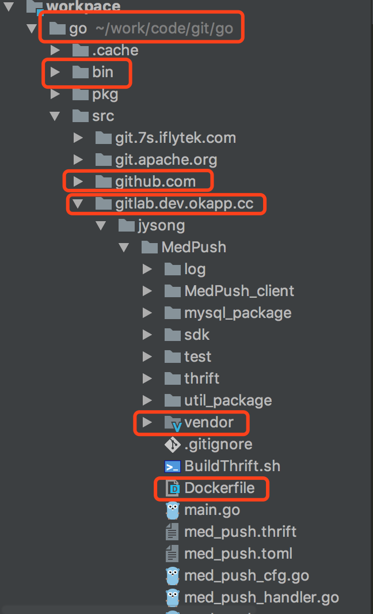

# pgo #
* go的开发框架，在这里集成了日志，配置文件，数据库等东西，方便改写使用  

## 开发流程 ##
1. go版本
* 1.8.3

2. IDE推荐
* gogland

3. 目录结构 

* 第一个红框表示GOPATH的路径
* 第二个红框是go get下来生成的二进制文件保存的地方，最好把这个路径添加到PATH
* 第三个红框是go get下载的github项目保存的目录
* 第四个红框是我们自己的gitlab的地址，我们以后的项目都在这个目录下开发（此图中MedPush就是一个项目）
* 第五个红框是govendor生成的包管理目录
* 第六个是没个项目的Dockerfile，用于docker build

4. 日志库 
* 日志库：github.com/cihub/seelog
* 介绍：https://godoc.org/github.com/cihub/seelog

<!-- 如果docker部署可以通过jenkins挂载配置文件进去
否则使用viper或者confd -->
5. 配置文件
* 使用：toml
* 介绍：https://godoc.org/github.com/BurntSushi/toml
* 说明：如果docker部署可以通过jenkins挂载配置文件进去，否则使用viper或者confd

6. 依赖包管理-govendor
* 使用：go get github.com/kardianos/govendor
* 介绍：https://github.com/kardianos/govendor  
　　　https://godoc.org/github.com/kardianos/govendor
     
7. 单元测试工具-gotests
* 使用：go get github.com/cweill/gotests
* 介绍：https://github.com/cweill/gotests  
　　　https://godoc.org/github.com/cweill/gotests

8. thrift开发包  
Init时需要传入handler生成的processor

9. jsonrpc2开发包  
* 使用：请参考目录下的example